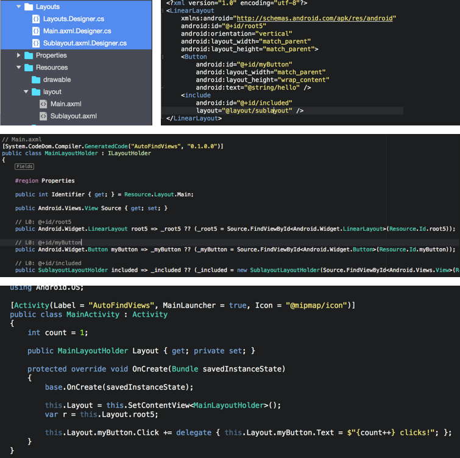

### *for Xamarin.Android*

Have you ever counted the number of times your wrote `FindViewById` in your **Xamarin.Android** project? Writing repetitive code is so boring ... **AutoFindFindViews** will generate all this boilerplate code for you.

## Install

Available on NuGet

## Usage

As soon as you added the reference to the [NuGet package](https://www.nuget.org/packages/AutoFindViews/), a target is added to your project that generates a classes in a `Layout` folder in your project output dir (`obj`) for each one of you `.axml` layout file.

**Warning:** files are generated only during build.

**Warning:** auto-completion can be broken (visual studio doesn't reload files at build time), is it occcurs, unload then reload the project.

**Warning:** Don't forget to dispose generated Layout !

## About

The project was made as a build task, and not with a [Single File Generator](https://msdn.microsoft.com/en-us/library/bb166817.aspx) for easiness of use. Unfortunately, **SFG** can't be distributed as a NuGet package and must be installed on the development environnements manually.

## Contributions

Contributions are welcome! If you find a bug please report it and if you want a feature please report it.

If you want to contribute code please file an issue and create a branch off of the current dev branch and file a pull request.

## License

MIT © [Aloïs Deniel](http://aloisdeniel.github.io)